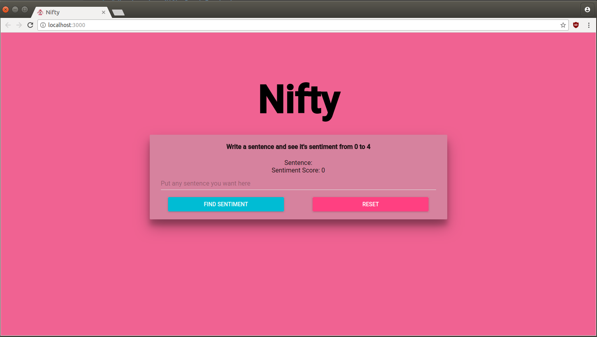
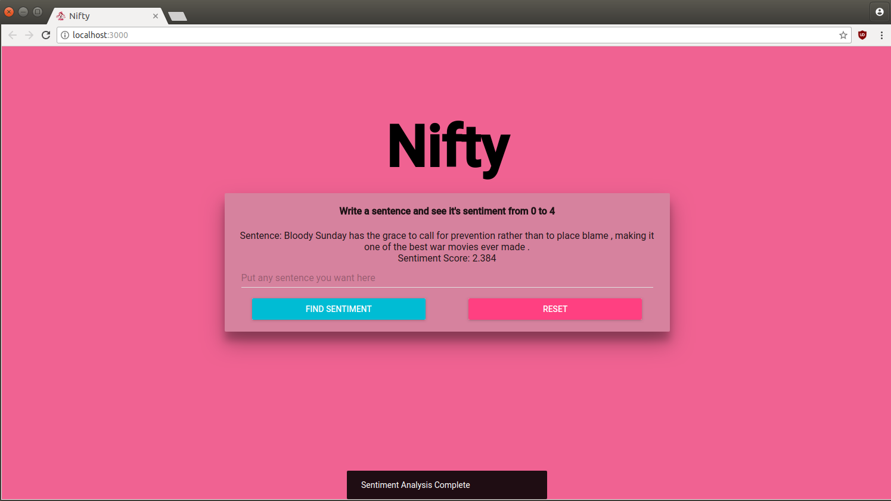

# How to set-up Nifty React Frontend
1. Clone the entire repo
2. Make sure you have Node installed (Version 8.11.1 recommended)
3. Install node_modules (npm install)
4. After that, make sure the flask server is running.
5. Afterwards, start the application (npm start)

